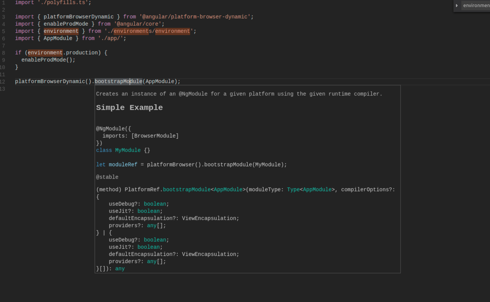

7.4.0.alpha01 =>

http://localhost:23160/bonita/platformloginservice?username=platformAdmin&password=platform

## Conclusion
- Too much for a single men.... Visual Studio code, angular2, webpack, typescript, angular-cli, ...

## Visual Studio code
- light
- plugins for everything
- html edition annoying
- no ctrl+space for errors (need plugin ?)
=> need to be practiced

## Typescript
- +1 private fields
- type (not used so much...)
- completion/errors
- DOC !!!!!!!

## Angular 2
- Very nice !!!
- +10000 error managements
- On est pas perdu

## Angular-cli
-1

IMHO pas mature (1.0.0), surtout aucune doc !!! oblige de farfouiller le web et lire des PRs...
Pas d'explications sur la structure de l'appli.
Pas de conf webpack ?
Declaratif.
Need to be creused

## Platform portal
- IMHO jvm infos + system properties useless + security issue (As Sam I don't want platform admin to see hardware infos, nor secret system properties)
- First step: One page with plateform infos + licence infos + tenant list
- Second step: action on tenants

## Next time
- Create and integrate in product page with license infos ?
- Scaffold platform Rest api v2 in engine ?